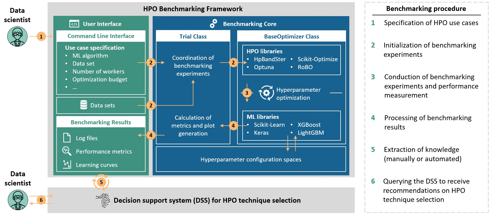

# HPO benchmarking framework
## Overview
- Software framework for benchmarking hyperparameter optimization (HPO) techniques for machine learning (ML) use cases in the production domain
- The framework can be used to apply HPO techniques to user-defined use cases in production and benchmark their performance comparably
- For each experiment, the framework provides several performance metrics, learning curves, and log-files
- It is possible to extend the framework by further HPO techniques, ML techniques, and data sets

---
## Usage
*Benchmarking process:*

*Usage:*
1. Run the script `run_benchmark.py` to start a benchmarking experiment (specify positional and optional arguments via the command line to define the use case)
2. The framework conducts the benchmarking experiments according to the setup and generates performance metrics, log-files, and learning curves
4. Optional: Apply further scripts from `./analysis` for a detailed performance analysis

*Exemplarly learning curve generated by the framework:*

---
## Integrated libraries and data sets

### HPO libraries and techniques
- HpBandSter: *BOHB and Hyperband*
- Optuna: *random search, TPE and CMA-ES*
- Scikit-Optimize: *GPBO and SMAC*
- RoBO: *FABOLAS and BOHAMIANN*

### ML libraries and techniques
- Scikit-Learn: *multilayer perceptron, random forest, support vector machine, AdaBoost, decision tree, linear regression, k-nearest neighbor, logistic regression, naive Bayes, and elastic net*
- Keras: *multilayer perceptron*
- XGBoost: *XGBRegressor and XGBClassifier*
- LightGBM: *LGBRegressor and LGBClassifier*

### Data sets
- Predictive maintenance
  - Air pressure system failures in Scania trucks ([Scania](https://www.kaggle.com/uciml/aps-failure-at-scania-trucks-data-set))
  - Turbofan engine degradation simulation ([Turbofan](https://data.nasa.gov/dataset/Turbofan-engine-degradation-simulation-data-set/vrks-gjie))
- Predictive quality
  - Surface crack detection ([Surface](https://www.kaggle.com/arunrk7/surface-crack-detection))
  - Sensor system production (Sensor)
- Process parameter prediction
  - Blade integrated disk manufacturing (Blisk)